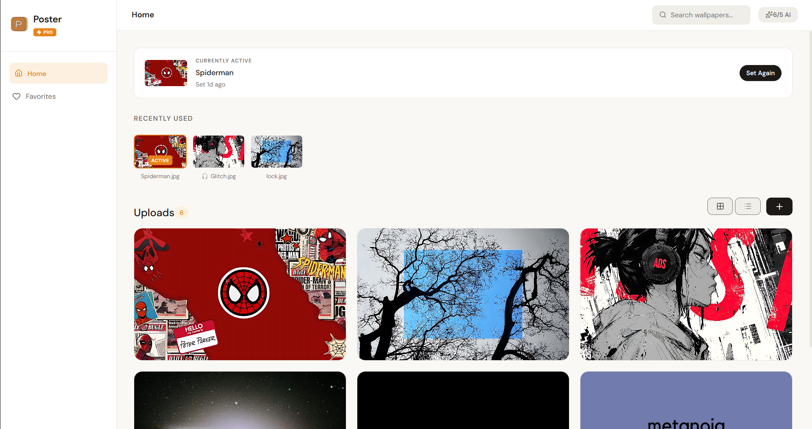

# 🖼️ Poster
**The Ultimate Desktop Wallpaper Experience.**

Poster is a premium, high-fidelity Electron application designed to give you total control over your desktop’s visual identity. With professional-grade image processing and a sleek, minimalist interface, it turns your wallpaper collection into a curated gallery.



---

## ✨ Features

### 🚀 Optimized Desktop Fit
Poster uses the power of **Sharp** for fast, local image processing to:
- **Rescale & Crop** images flawlessly to your monitor’s exact native resolution.
- **Normalize Formats** to guarantee smooth application and reliable rendering.

### ⚡ Instant Application
Set your wallpaper directly from the app. No more digging through system settings. Supports multiple file formats (JPG, PNG, WEBP).

### 🎨 Modern Design System
- **Dark Mode by default** – focusing on what matters: the art.
- **Glassmorphic UI** – subtle transparencies and smooth transitions.
- **Intuitive UX** – From onboarding to advanced management, every interaction feels fluid.

---

## 🔮 Coming Soon (Roadmap)

We are actively developing Poster and have exciting updates on the horizon:

### 🤖 AI Enhancements
Intelligent, AI-driven upscaling and image enhancement features are currently in development. We are refining our backend infrastructure to support these powerful capabilities, which will be available in a future update.

### 🍱 Boards & Collections (Pro)
Organize your inspiration into **Boards**. Whether it’s 'Minimalism', 'Nature', or 'Cyberpunk', Poster will soon let you group and manage your wallpapers into beautifully curated collections.

---

## 🛠️ Tech Stack

- **Framework**: [Electron](https://www.electronjs.org/) (Main process) + [React](https://reactjs.org/) (Renderer)
- **Bundler**: [Vite](https://vitejs.dev/)
- **Image Processing**: [Sharp](https://sharp.pixelplumbing.com/)
- **Storage**: [Electron Store](https://github.com/sindresorhus/electron-store)
- **Styling**: Vanilla CSS (Tailored Design Tokens)
- **Icons**: [Lucide React](https://lucide.dev/)

---

## 🚀 Getting Started

### Prerequisites
- [Node.js](https://nodejs.org/) (v18 or higher recommended)
- [pnpm](https://pnpm.io/) (Recommended) or npm/yarn

### Installation

1. **Clone the repository:**
   ```bash
   git clone https://github.com/nueldotdev/Poster.git
   cd PosterV1
   ```

2. **Install dependencies:**
   ```bash
   pnpm install
   ```

3. **Start the application:**
   ```bash
   pnpm start
   ```

---

## 📜 Available Scripts

- `pnpm start`: Launches the application in development mode.
- `pnpm run package`: Packages the app for your current platform.
- `pnpm run make`: Creates an installer/distributable for the app.
- `pnpm run lint`: Checks for code quality and bugs.

---

## 🛡️ License

Distributed under the MIT License. See `LICENSE` for more information.

---

<p align="center">
  Built with ❤️ by nuel
</p>
